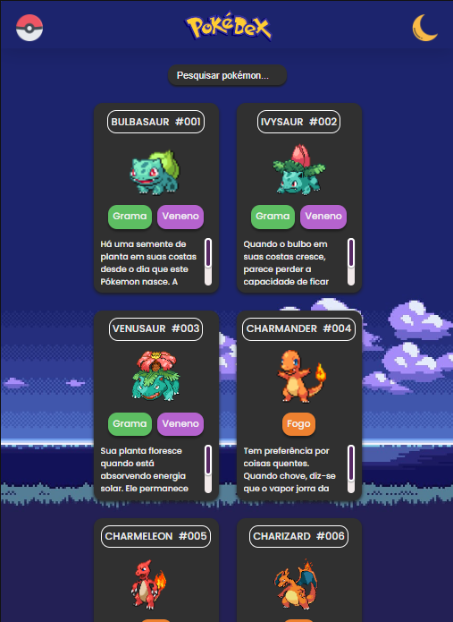

# PokéCards

  

## Desing: 
* 

## Descrição

  

   Este é um projeto que permite aos usuários visualizar uma listagem de Pokémons e uma página com todos os Tipos em cartões. É 
   uma aplicação web que utiliza HTML, CSS e JavaScript para alcançar esse objetivo. atualmente hospedado no 
    <a href="https://gabrielduartep.github.io/projeto-pokecards/">GitHub-Pages</a>.
  

## Funcionalidades
  1. Tema escuro: O usuário pode alternar entre o tema claro e escuro;
  2. Pesquisa individual: Ao clicar na barra de pesquisa, tanto na página dos pókemons quanto ná página dos tipos, o usuário poderá procura a informação desejada.
  3. Informações Pokémons: Ao clicar em Pokedex, o usuário verá os cartões individuais apresentando um pokémon, número de ordem, tipagem e descrição.
  4. Informações Tipos: Ao clicar na Pokébola, o usuário verá os cartões individuais apresentando todos os tipos, suas vantagens e desvantagens
  5. Design responsivo para se adaptar a diferentes tamanhos de tela.

## Tecnologias utilizadas:

 * HTML
 * CSS
 * JAVASCRIPT

 ### Pra entrar em contato, veja as redes abaixo!
 

 
  
  
   

